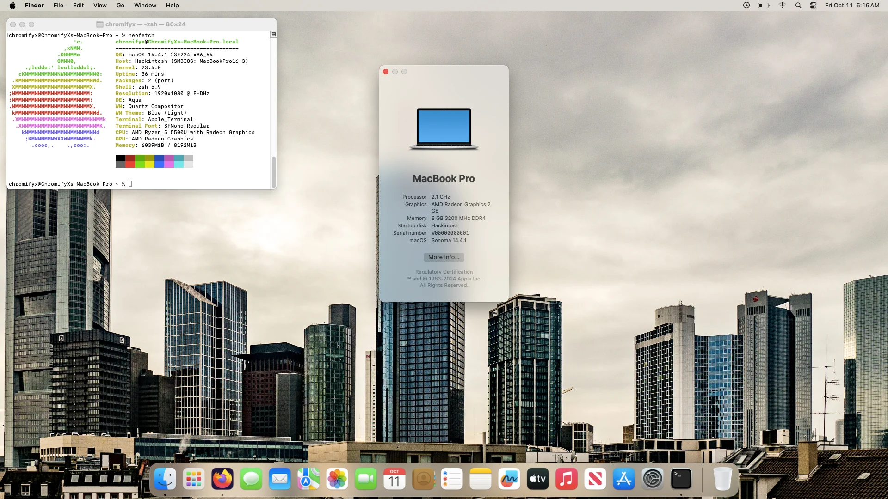

# Hackintosh 14 (Sonoma)

 

# Warning:
This repository may be deleted at any time, and using a prebuilt EFI is **not** recommended unless you have the same hardware compatibility for this EFI. I am not responsible for any damage or bricking of your laptop. Deal with it..

# Note:
The config.plist doesn't have any serial-numbers or GUID's init, so you may need to configure the file yourself.

# Status:
EFI is being detected as it's fully working!

# System Requirements:
**1- Laptop Model:** Lenovo Ideapad 3 (15ALC6)
 
 
**2- CPU:** Ryzen 5 5300U, 5500U, and 5700U.
 
 
**3- GPU:** Has an iGPU and doesn't have a dGPU (Nvidia won't work..)
 
 
**4- Some Skills (Diagnosing, and fixing):** You'll need it for this to work. Without it, then good luck. 

# What's working:
**1- Trackpad**
 
 
**2- Sound**
 
 
**3- iGPU and Graphics Acceleration**
 
 
**4- Everything**

# What's not working:
**1- Wi-Fi**
 
 
**2- Bluetooth**
 
 
**3- Apple Imessage, Facetime**

# How to use:
Install python (3, not 2), Use the macrecovery tool to get the RecoveryOS (As of 9/29/2024, the latest version is currently recoveryOS 14.),
Format the flash drive with rufus or any software you have, and put the dmg in the flash drive as well as the EFI Folder.
